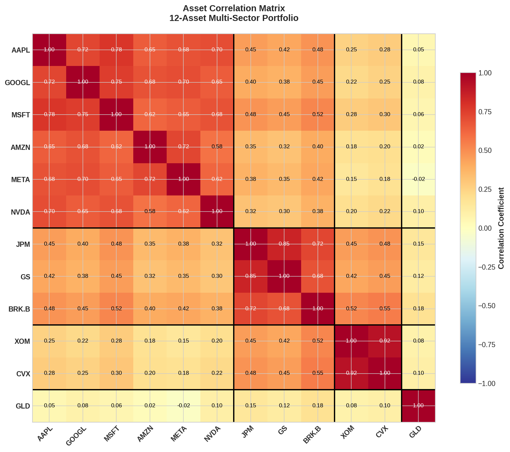
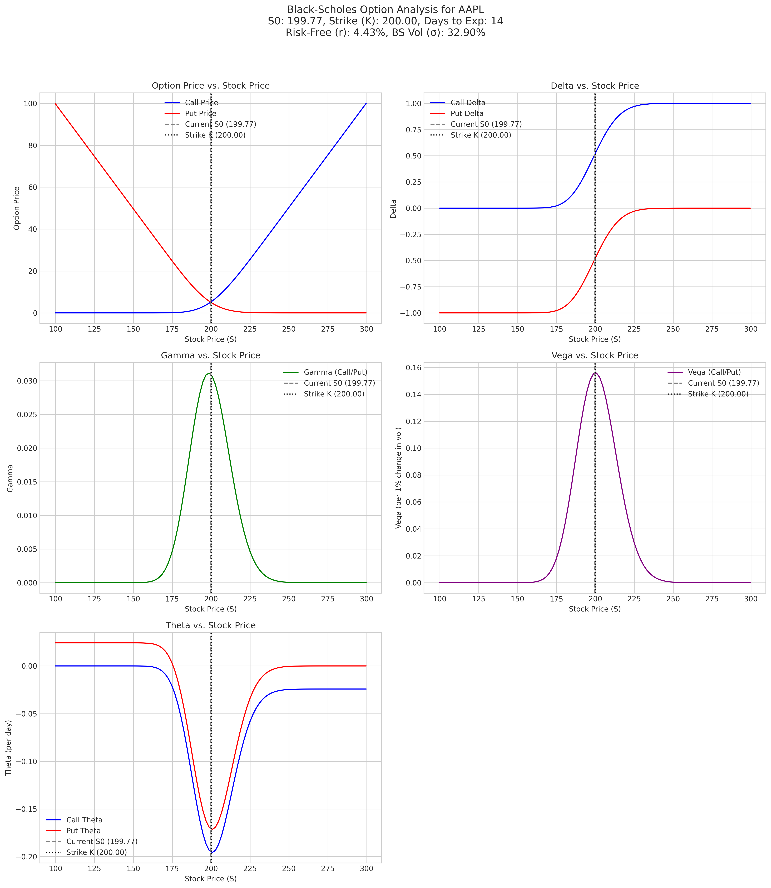
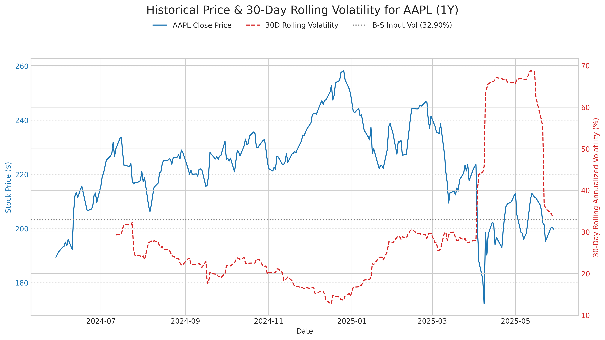

# Hey, I'm Joshua Zayne 👋

I spent nine years across the Navy and Air Force as a behavioral health technician, and psychometrician. then audited $75M in federal programs at the VA. Now I build systematic trading strategies and risk models as **Head of Multi-Asset Strategies** at Dimaskus Capital.

That path might seem random, but the throughline is the same: **finding signal in noise**—whether that's in a patient's chart, a federal budget, or overnight futures data.

---

## 🔥 Featured Work

### Portfolio Optimization Toolkit
> **Full implementation of Modern Portfolio Theory with interactive CLI**

A production-grade Python package for efficient frontier analysis, tangent portfolio optimization, and capital market line calculations. Supports short-selling constraints, multiple data frequencies, and automated report generation.

**[📂 View Repository](https://github.com/ohjoshrules/Efficent_Frontier)**

**Key Features:**
- Mean-Variance Optimization via SLSQP
- Two-Fund Separation Theorem implementation
- Automated Excel/CSV ingestion with return conversion
- CLI + Python API interfaces

<b>📐 The Math Behind It</b>

**Portfolio Return:**
$$\mu_p = \mathbf{w}^\top \boldsymbol{\mu}$$

**Portfolio Variance:**
$$\sigma_p^2 = \mathbf{w}^\top \boldsymbol{\Sigma} \mathbf{w}$$

**Sharpe Ratio (Objective Function):**
$$SR = \frac{\mu_p - r_f}{\sigma_p}$$

**Optimization Problem:**
$$\max_{\mathbf{w}} \frac{\mathbf{w}^\top \boldsymbol{\mu} - r_f}{\sqrt{\mathbf{w}^\top \boldsymbol{\Sigma} \mathbf{w}}} \quad \text{s.t.} \quad \sum_{i=1}^{n} w_i = 1$$

---

### Monte Carlo Risk Engine
> **500,000+ simulated paths for portfolio stress testing**

Production system generating nightly risk projections across multi-asset portfolios. Outputs VaR, CVaR, and confidence intervals for next-day P&L distribution.

<b>📐 The Math Behind It</b>

**Geometric Brownian Motion:**
$$dS_t = \mu S_t \, dt + \sigma S_t \, dW_t$$

**Discretized Price Path:**
$$S_{t+\Delta t} = S_t \exp\left[\left(\mu - \frac{\sigma^2}{2}\right)\Delta t + \sigma \sqrt{\Delta t} \, Z\right]$$

where $Z \sim \mathcal{N}(0,1)$

**Value-at-Risk (95%):**
$$\text{VaR}_{0.95} = -\inf\{x : P(L \leq x) \geq 0.05\}$$

**Conditional VaR (Expected Shortfall):**
$$\text{CVaR}_{0.95} = \mathbb{E}[L \mid L \geq \text{VaR}_{0.95}]$$

---

### Returns Distribution & Risk Analytics

Statistical analysis of portfolio returns with tail risk quantification. Implements parametric and historical VaR with higher-moment adjustments.

---

### Multi-Asset Correlation Analysis

Cross-sector correlation monitoring for portfolio construction and risk decomposition. Identifies regime changes and diversification opportunities.

---

### Systematic Strategy Backtesting
> **Long-short multi-factor model with drawdown analytics**

Framework for strategy validation including transaction costs, slippage modeling, and benchmark-relative performance attribution.

<b>📐 Performance Metrics</b>

**Sharpe Ratio:**
$$SR = \frac{\bar{r}_p - r_f}{\sigma_p}$$

**Maximum Drawdown:**
$$\text{MDD} = \max_{t \in [0,T]} \left( \max_{s \in [0,t]} V_s - V_t \right) / \max_{s \in [0,t]} V_s$$

**Information Ratio:**
$$IR = \frac{\alpha}{\sigma_{\epsilon}} = \frac{\bar{r}_p - \bar{r}_b}{\sigma_{r_p - r_b}}$$

**Calmar Ratio:**
$$\text{Calmar} = \frac{\text{CAGR}}{\text{MDD}}$$

---

## 📊 Additional Research

### [Black-Scholes Greeks Analysis](./AAPL_BS_Greeks_K200_T14d.pdf)
Full Greeks surface visualization (Δ, Γ, Θ, ν, ρ) for equity options pricing.

### [Historical Volatility Modeling](./AAPL_historical_vol_analysis_1Y.pdf)
Rolling realized volatility vs. implied vol analysis for mean-reversion signals.

### [Econometric Alpha Signals](./Econometric%20Alpha%20Signal%20Part%201)
Two-part research on systematic factor construction and out-of-sample validation.

📄 [Part 1](./Econometric%20Alpha%20Signal%20Part%201) | [Part 2](./Econometric%20Alpha%20Signal%20Part%202page%2012_18.pdf)

### [DiD Study: Centralized vs. Decentralized Banking](./DiD%20on%20centeralized%20vs%20de-centeralized%20banking%20practices.pdf)
Causal inference analysis of structural banking practice differences using Difference-in-Differences methodology.

---

## 🛠️ Technical Stack

| Domain | Tools & Methods |
|--------|-----------------|
| **Quant Modeling** | Monte Carlo, GARCH, ARIMA, Black-Scholes, Multi-factor models, Kalman filters |
| **Optimization** | Mean-Variance (SLSQP), Risk Parity, Black-Litterman, Convex optimization |
| **Programming** | Python (NumPy, Pandas, SciPy, statsmodels), STATA, VBA, SQL |
| **Infrastructure** | InfluxDB, REST/WebSocket APIs, real-time data pipelines |
| **Risk Metrics** | VaR, CVaR, Greeks, Stress testing, Scenario analysis |

---

## 🚀 Recent Impact

| Project | Result |
|---------|--------|
| Monte Carlo Risk Engine | 500k+ paths/night for multi-asset stress testing |
| Pricing Automation Pipeline | 50k+ daily records, 37% cycle time reduction |
| Federal Audit Dashboards | $75M spend monitoring, 70% manual review reduction |
| Healthcare Process Improvement | 98% reduction in medication errors |

---

## 📚 Background

**Education**
- **M.S. Finance** — University of Utah, David Eccles School of Business (2025)
- **B.S. Quantitative Analysis** — University of Utah (2024)
- **B.S. Applied Mathematics** — University of Utah (2024)

**Experience**
- Head of Multi-Asset Strategies, Futures & Equity — Dimaskus Capital
- Federal Auditor & Program Analyst — U.S. Department of Veterans Affairs
- Lead Petty Officer, Behavioral Health — U.S. Navy & Air Force

---

## 🌲 Outside the Terminal

Night hiker. Archery competitor. ATV adventurer. Yearly international trip planner with my kids. Always down for ping pong.

---

## 📫 Connect

